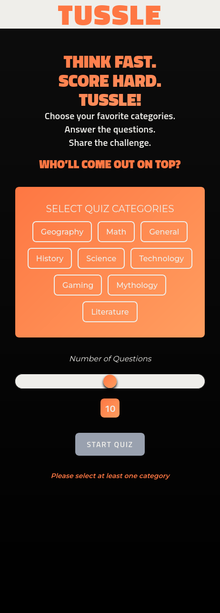
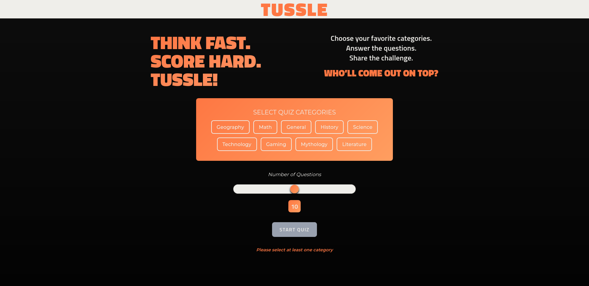

# TUSSLE - Quiz Challenge App

A modern, interactive quiz application built with Next.js that allows users to take quizzes across multiple categories and challenge their friends with personalized quiz links.

## Features

- **Multi-Category Quizzes**: Choose from 9 different categories including Geography, Math, Science, Technology, Gaming, and more
- **Customizable Quiz Length**: Select between 5-15 questions per quiz
- **Friend Challenge System**: Generate shareable links to challenge friends with the same questions you answered
- **Real-time Results**: View detailed results with correct/incorrect answer breakdowns
- **Responsive Design**: Fully responsive interface that works on desktop and mobile devices
- **Modern UI**: Clean, gradient-based design with smooth animations and transitions

## Tech Stack

- **Frontend**: Next.js 15, React 19, TypeScript
- **Styling**: Tailwind CSS with custom themes and components
- **Database**: MongoDB with Mongoose ODM
- **Icons**: React Icons, Lucide React
- **Animations**: Framer Motion
- **Loading States**: React Spinners

## Live Demo

[Live Site](https://tussle-quiz.vercel.app/)

## Screenshots




## Getting Started

### Prerequisites

- Node.js 18+
- MongoDB database (local or cloud)
- npm or yarn package manager

### Installation

1. Clone the repository

```bash
git clone [repository-url]
cd quiz-app
```

2. Install dependencies

```bash
npm install
```

3. Set up environment variables
   Create a `.env.local` file in the root directory:

```env
MONGO_URI=your_mongodb_connection_string
```

4. Seed the database

```bash
npm run seed
```

5. Run the development server

```bash
npm run dev
```

6. Open [http://localhost:3000](http://localhost:3000) in your browser

## Project Structure

```
src/
├── app/
│   ├── api/
│   │   ├── challenge/          # Challenge creation and retrieval endpoints
│   │   └── questions/          # Questions API endpoint
│   ├── challenge/[challengeId]/ # Dynamic challenge pages
│   ├── quiz/                   # Quiz gameplay page
│   └── page.tsx               # Home page with category selection
├── components/
│   ├── AnswersDisplay.tsx     # Individual answer result component
│   ├── Header.tsx             # App header
│   ├── Loader.tsx             # Loading spinner component
│   ├── QuestionCard.tsx       # Quiz question display
│   └── ResultsDisplay.tsx     # Quiz results and challenge generation
├── lib/
│   ├── dbConnect.ts           # MongoDB connection utility
│   ├── types.ts               # TypeScript type definitions
│   └── questions.json         # Sample questions data
├── models/
│   ├── Challenge.model.ts     # Challenge MongoDB schema
│   └── Question.model.ts      # Question MongoDB schema
└── scripts/
    └── seedDB.ts              # Database seeding script
```

## How It Works

### Quiz Flow

1. **Category Selection**: Users select their preferred quiz categories from 9 available options
2. **Question Count**: Choose the number of questions (5-15) using an interactive slider
3. **Quiz Gameplay**: Answer questions one by one with immediate progression
4. **Results**: View detailed results showing correct/incorrect answers with explanations

### Challenge System

1. **Challenge Creation**: After completing a quiz, users can generate a challenge link
2. **Friend Challenge**: Share the generated link with friends
3. **Challenge Completion**: Friends take the same quiz questions
4. **Results Comparison**: Compare scores to determine the winner

## API Endpoints

- `GET /api/questions` - Fetch all available questions
- `POST /api/challenge` - Create a new challenge with specific questions
- `GET /api/challenge/[challengeId]` - Retrieve challenge details

## Database Schema

### Question Model

- `text`: Question content
- `options`: Array of answer choices
- `answer`: Correct answer
- `category`: Question category

### Challenge Model

- `originalScore`: Original player's score
- `questionIds`: Array of question IDs used in the challenge
- `createdAt`/`updatedAt`: Timestamps

## Customization

### Adding New Categories

1. Update the `availableCategories` array in `src/app/page.tsx`
2. Add questions with the new category to your database

### Styling

The app uses a custom Tailwind configuration with CSS variables for theming:

- Primary colors: Orange gradient (`#fe7743` to `#ff9e60`)
- Background: Dark theme with gradient
- Custom components: Buttons, cards, and form elements

## Contributing

1. Fork the repository
2. Create a feature branch (`git checkout -b feature/new-feature`)
3. Commit your changes (`git commit -am 'Add new feature'`)
4. Push to the branch (`git push origin feature/new-feature`)
5. Create a Pull Request

## License

This project is open source and available under the [MIT License](LICENSE).

## Acknowledgments

- Built with Next.js and React
- Styled with Tailwind CSS
- Icons from React Icons and Lucide React
- Database powered by MongoDB
